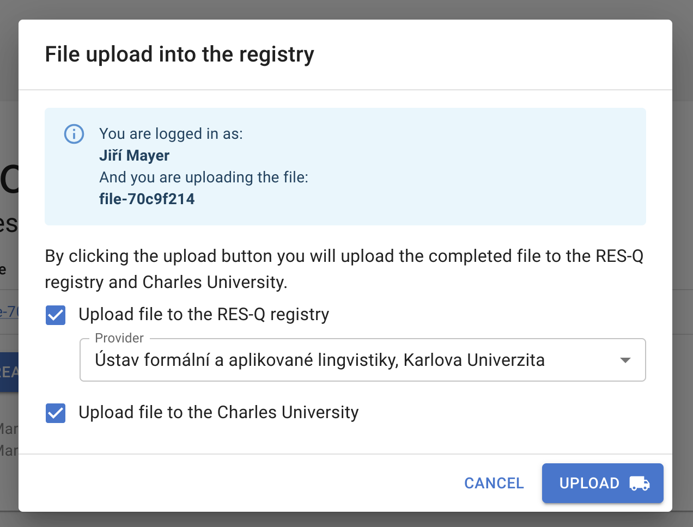

# Uploading annotated files - a tutorial

This tutorial explains how to upload an annotated file to ÚFAL and RES-Q+. It describes the workflow primarily for the development depoyment of the tool,
but the production flow is almost idential. The differences are mentioned when necessary.

First, open up the development deployment of DocMarker for RES-Q+ at:
https://ufallab.ms.mff.cuni.cz/~mayer/development-resq-doc-marker/

> **Note:** The production deployment runs at:
> https://quest.ms.mff.cuni.cz/resq-doc-marker/

We will test the process on a brand new file. In production though, you would start with a file that is ready, fully annotated, without any validation errors.

> **Note:** The file can be uploaded regardless of validation errors or missing values.

Create a new file by clicking the `Create new file` button. Use the default form and click `Create` in the dialog. Switch to the `Annotate` mode in the top right mode selector. In the form, fill out an age of 42 in the `Age at stroke onset`, so that we have some data to see in the uploaded file.

Now, in the top menu, click `Tools > Upload file to RES-Q`. You will be redirected to the login page of the RES-Q registry. Specifically, the *development* deployment at the domain `auth.dev.qualityregistry.org` (see the `dev` in the domain). Log in with your development RES-Q account.

> **Note:** The production deployment of DocMarker will redirect you to the production deployment of RES-Q registry.

> **Note:** If you are already logged-in, you will not see the login form and be redirected right back to the DocMarker tool.

After logging in, you will be redirected back to DocMarker. Now you should see a dialog window, showing metadata about yourself and the file you want to upload:



You can click the `Upload` button and the necessary actions will be performed.

When the upload finishes, you will be shown a green success box with assigned *Case ID* from the RES-Q registry. This case ID will be stored in the DocMarker file so that any future uploads will modify the data for this RES-Q case, instead of creating a new one.

You can click the `Close` button, which takes you back to the welcome screen of DocMarker.


## Interacting with the created RES-Q case

Uploading to RES-Q is not implemented. The goal is to only create the case and upload data, but let the user themselves to verify the data in RES-Q and submit manually.

TODO


## Locating the uploaded file at ÚFAL

The file was uploaded to the ÚFAL network to:

```
/lnet/work/projects/resq-plus/data/raw-uploads/development
```

> **Note:** There is also the `production` folder where files from the production deployment are uploaded.

The file name is composed from the time of upload (as seen by the server) and the UUID of the file:

```
2024-04-25T10:50:34.154628_b3faebb9-2d91-4b8e-a6f0-f3b422f23641.json
```

The file has access rights of `-rw-rw---`, that is, readable and modifyable by anyone in the group, but noone else. Only users that are members of the `resq-plus` unix group have access to these files. They can be listed by running:

```bash
getent group resq-plus
```

If a file is uploaded multiple times, it will be present here multiple times as well. It's up to the consumer of this data to perform de-duplication. Also, don't modify the data in the `raw-uploads` folder (except for clearing the development uploads folder), instead, copy the files to some other folder and make updates there.

The uploaded file contains metadata about the upload, see the fields `uploadedAt` (from the client's perspective), `uploadedByUser`, and `resqCaseId` at the very end:

```json
{
  "_version": 1,
  "_docMarkerVersion": "0.6.0-dev",
  "_docMarkerCustomizationVersion": "0.2.0-dev",
  "_docMarkerCustomizationName": "DocMarker for RES-Q+",
  "_uuid": "b3faebb9-2d91-4b8e-a6f0-f3b422f23641",
  "_fileName": "",
  "_createdAt": "2024-04-25T08:42:49.597Z",
  "_updatedAt": "2024-04-25T08:44:45.733Z",
  "_appMode": "ANNOTATE_HIGHLIGHTS",
  "_formId": "Official ResQ 3.1.1",
  "_formData": {
    "anamnesis": {
      "age": 42
    }
  },
  "_reportDelta": {
    "ops": []
  },
  "_reportText": "\n",
  "_highlights": {},
  "uploadedAt": "2024-05-26T22:31:24.052954Z",
  "uploadedByUser": {
    "id": "3bbf673a-a0d4-4492-96d0-3dc376e29cfe",
    "firstName": "Jiří",
    "lastName": "Mayer",
    "title": "",
    "providerId": 265,
    "providerName": "Ústav formální a aplikované lingvistiky, Karlova Univerzita"
  },
  "resqCaseId": "abd74ecf-8994-4ed9-a0b0-179e217f9d11",
  "resqRecordId": 224
}
```


## Cleaning up the development folder

To clear files from the development folder, copy the following command (to make sure you don't accidentally make a typo and delete the production ones):

```bash
rm /lnet/work/projects/resq-plus/data/raw-uploads/development/*.json
```

> **Note:** You can prepend `echo` before the command to see what is going to be executed before you actually run it.
