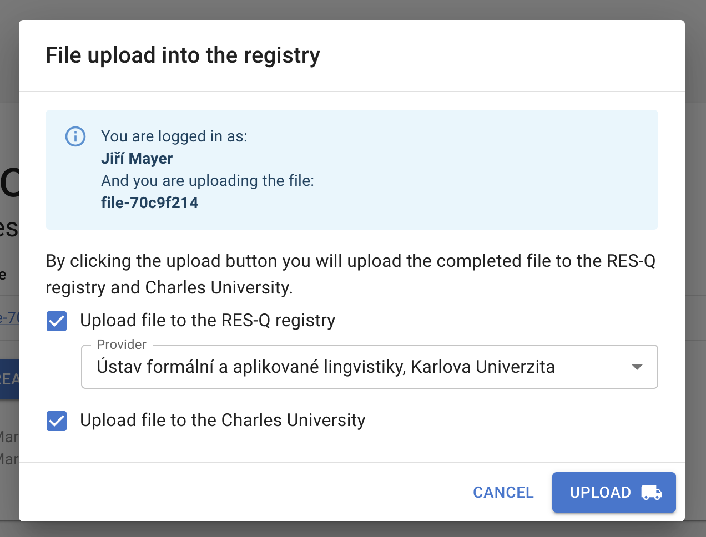

# Workflow for annotated file uploading - User manual

This tutorial explains how to upload annotated files to RES-Q and ÚFAL.

The production DocMarker for RES-Q+ runs at:
https://quest.ms.mff.cuni.cz/resq-doc-marker/

First, create a new file for a new stroke case and fill out its contents (paste in the discharge report, fill out the form, and annotate text spans). Once that is done, you can upload the file to RES-Q and ÚFAL:

With the completed file open, in the top menu, click `Tools > Upload file to RES-Q`. You will be redirected to the login page of the RES-Q registry at `auth.qualityregistry.org`. Log in with your RES-Q account.

> **Note:** If you are already logged-in, you will not see the login form and be redirected right back to the DocMarker tool.

After logging in, you will be redirected back to DocMarker. Now you should see a dialog window, showing metadata about yourself and the file you want to upload:

You can click the `Upload` button and the necessary actions will be performed.

When the upload finishes, you will be shown a green success box with assigned *Case ID* from the RES-Q registry. This case ID will be stored in the DocMarker file so that any future uploads will modify the data for this RES-Q case, instead of creating a new one.

Clicking the link at the bottom of the green box will open the created RES-Q case in a new tab. There you can verify the uploaded data and submit the case.

You can click the `Close` button on the dialog, which takes you back to the welcome screen of DocMarker.

Because the Charles University upload checkbox was checked, the file is also uploaded to ÚFAL to be used for research.

## More about the RES-Q upload

When you upload a file that has not been uploaded before, a new RES-Q case is created and filled out with the data.

The case is created in the *draft* mode and you then must manually submit the case from the RES-Q web application (link to which is displayed by DocMarker after successful upload).

If you make changes to the DocMarker file and upload again, the corresponding RES-Q case is updated. If the case is already submitted, the upload will fail. To update an already submitted case, you need to set it back to draft mode from inside the RES-Q web application.

Uploading an already uploaded file provides a warning and the link to the case before the upload is finalized:

## A note on file names

DocMarker lets you name files in any way. By default, if the file has no name, the file's UUID is used to produce a placeholder name, such as `file-70c9f214`. **Do NOT use the patient name as the filename!** The name of the file is stored inside the file itself and uploading the file to ÚFAL would leak the patient's name, which is personal information.

You could leave the filename empty and after uploading to RES-Q rename the file to the case ID (e.g. `b8ea8ef0-23dd-4983-9f63-ac2a973f3cd9`) or maybe the case record number, which is shorter and more readable (e.g. `#2174`). Or you can use any other scheme that makes sense in your setting that does not leak any personal information about the patient.
